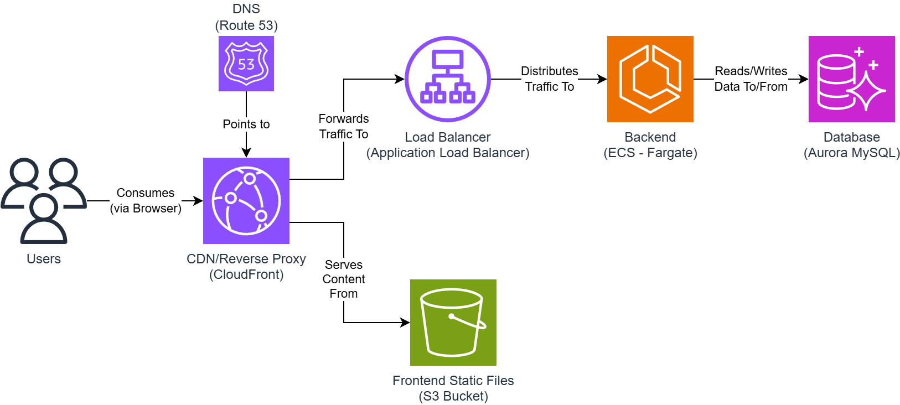

# Conduit - AI Augmented Design and Implementation

In this assessment, you will work on a realistic task that closely resembles issues you may face on the job. You will extend a full-stack TypeScript project. The project has a NestJS backend and a React frontend. Your task is to add a new user story using the AI tool. The goal is to show your skills in planning and guiding the AI while keeping long-term code quality in mind.

In Production, this application is deployed on AWS following the architecture below. Any changes you make must work within this architecture, otherwise once your story is released, it will not properly work.

## Preparation Steps

Before starting the assessment, you should:

1. **Learn the Technologies:**

   - Review the project's technologies (NestJS, React, TypeScript, AWS).
   - Understand the architecture from the provided diagram.

2. **Set Up GitHub Codespaces:**

   - Create a free GitHub Codespaces account at [GitHub Codespaces](https://github.com/settings/codespaces).
   - Open the Codespace using [this link](https://github.com/codespaces/new?repo=678723453&ref=rwa/design-and-implementation-v1).
   - Your environment will automatically install all dependencies, seed the database, and start both the backend and frontend servers.
   - Visit [http://localhost:3001](http://localhost:3001) in your browser. Log in with:
     - **Email:** jcosten0@purevolume.com
     - **Password:** password

3. **Review the Codebase:**

   - **Frontend:** Located in the `frontend` folder.
   - **Backend:** Located in the `backend` folder (includes database migrations).
   - Spend time exploring the code to understand its structure and logic.

4. **Use Aider:**

   - You must use the pre-installed Aider CLI for all your AI interactions.
   - Follow the [Aider documentation](https://aider.chat/docs/usage/tutorials.html) to learn how to use the tool.
   - You will use an assessment-specific API key (provided on the Crossover page) which allows about 100 messages.
   - **Important:** Do not delete the files `.aider.chat.history.md` or `.aider.input.history`.

5. **Understand how to Plan:**

   - Read the [plan.md](./plan.md) file to know how to structure your implementation plan.

6. **Review Evaluation Criteria:**
   - Check the criteria to know how your work will be graded.
   - Focus on clarity, code quality, correctness, effective AI usage, and speed of delivery.

## Mandatory Rules

- **Do Not Fork**: Work on the provided repository. The submission script will malfunction if you fork the repository and push to it.
- **Use the Correct Branch**: There are other assessment branches in the repository. You must be on rwa/design-and-implementation-v1.
- **Start with a Plan**: When implementing, first derive your plan from the user story. If you submit without a plan, you'll get 0 stars.
- **Single AI Tool**: Use Aider exclusively for AI interactions.
- **Preserve Aider Files**: Do not delete .aider.chat.history.md or .aider.input.history. If you submit without these files, you'll get 0 stars.

## Notes

- **API Docs:** You can find the API documentation at [http://localhost:3000/docs](http://localhost:3000/docs).

- **Testing:** The project does not include tests. You are not required to write any tests for this task.

- **Aider:** Think of Aider as a junior developer with good general knowledge but little context about the project. Provide clear instructions and reference specific files when asking for changes.

- **Environment:** If you cannot use Codespaces, you can set up a local development environment by following [these steps](https://www.perplexity.ai/search/what-are-the-concise-precise-s-khlwVDwQTMODLaC6wB_7DQ).

## Evaluation Criteria

| **Criteria**       | **Description**                                    | **0 Stars**           | **1 Star**                    | **2 Stars**                                 | **3 Stars**                                          |
| ------------------ | -------------------------------------------------- | --------------------- | ----------------------------- | ------------------------------------------- | ---------------------------------------------------- |
| **Plan Soundness** | How clear and complete your plan is.               | No plan submitted     | Plan is incomplete or unclear | Some details missing and unclear rationale  | Clear, complete plan with detailed technical reasons |
| **Code Quality**   | Code cleanliness, efficiency, and maintainability. | Code is very messy    | Code quality is poor          | Mostly clean with minor issues              | Clean, efficient, and follows best practices         |
| **Correctness**    | Does the feature work as required?                 | Feature does not work | Only BASIC features work | ADVANCED features work with some bugs       | Fully functional with no bugs                        |
| **AI Usage**       | How well you guide and use the AI tool.            | AI not used at all    | Basic or unclear usage        | Mostly clear instructions with minor issues | Clear, effective, and well-guided AI usage           |
| **Velocity**       | Time taken to complete the task.                   | Task not finished     | Took several days             | Completed in 6 hours or less                | Completed in 3 hours or less                         |

## Next Steps

Once you are ready, click the link on the Crossover assessment page to get the user story requirements. Create your plan, follow it, work carefully within the architecture, and ensure your changes integrate smoothly with the existing project.
